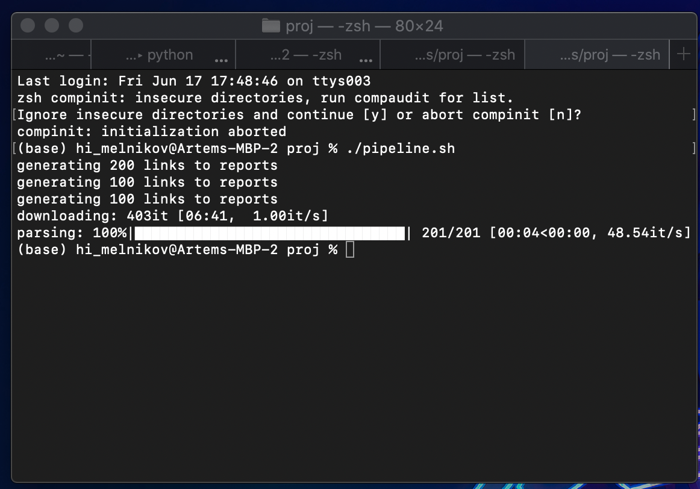
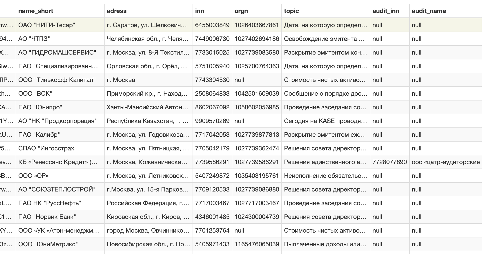

# Автоматизация работы с документами: извлечение сущностей и фактов из сообщений о раскрытии

Основная идея работы заключается в нахождении паттернов с помощью регулярных выражений

Это возможно тк большинство отчетностей имеют схожую структуру и повторяющиеся данные

Были попытки использовать более интересные решения рассмотренные на лекциях/семинарах, но по различным причинам они оказались не эффективны в данном контексте  
Основная проблема - языковые модели требуют огромного кол-ва размеченных данных, а у нас просто много текстов, которые совсем не имею разметки

## Примеры использования

Основная идея заключается в том, чтобы выбрать/распарсить набор документов, далее скормить набору модулей с regex, чтобы достать нужные данные

С точки зрения юзера - вызвать ряд скриптов. Последовательность и аргументы были подобраны заранее и собраны в pipeline.sh

## Результаты

В итоге получаем таблицу с данными о каждом из документов:

На местах, где информация отсутствует стоят NULL
(Не везде есть какая-либо речь про аудиторов. Советы директоров же вообще раскрывают единицы. Обычно есть только фио гендиректора)

Итоговые данные были сконвертированы в parsed_results.xlsx для удобства

## Пояснение структуры проекта

* link_generator.py - генерирует список страниц, которые надо скачать и распарсить
* html_downloader.py - скачивает нужные страницы и сохраняет их
* html_parser.py - парсит html и достает нужную информацию
* sql_wipe.py - пересоздает базу данных
* pipeline.sh - скрипт с заранее заданными аргументами, который за тебя все делает
